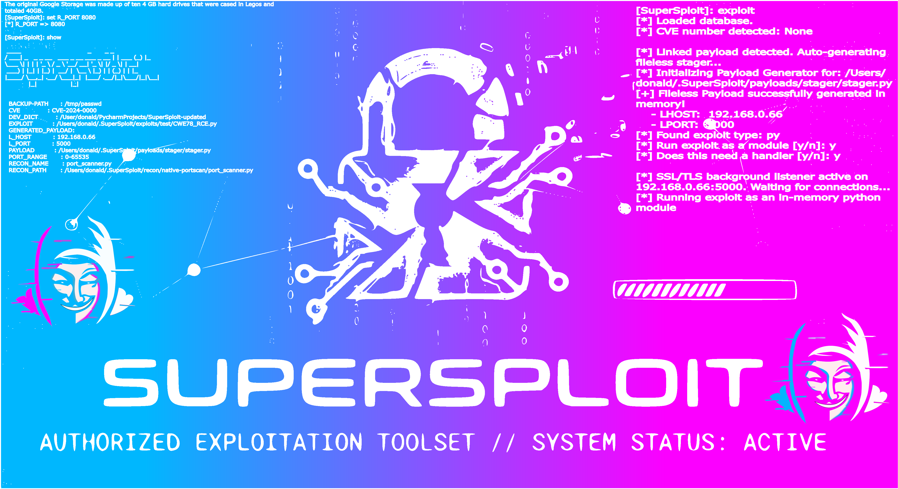

<p align="center">
  
</p>

<h1 align="center">SuperSploit Framework v2</h1>

<p align="center">
  <strong>A Modern, Stealth-Focused C2 & Exploitation Framework for Elite Red Teams.</strong>
</p>
<p align="center">
  <em>From Recon to Root, Undetected.</em>
</p>

---

> SuperSploit is an advanced, stealth-focused exploitation and Command & Control (C2) framework built for elite red teamers and penetration testers. It specializes in **fileless payload execution**, **in-memory C2**, **hybrid weaponization**, and **comprehensive Android targeting**, providing a seamless, automated pipeline from high-speed reconnaissance to deep post-exploitation.

> By fusing an asynchronous, highly concurrent Recon Engine with an intelligent, multi-dimensional Suggestion Engine and a resilient Cryptography System, SuperSploit significantly reduces operator workload while evading modern signature-based detection mechanisms.

---

## 🚀 Core Pillars & Architecture

### 👻 **Stealth & Evasion**
SuperSploit is engineered from the ground up for low observability and operational security.
*   **In-Memory Execution Pipeline:** The Exploit Engine avoids disk I/O entirely. Python modules are compiled and executed directly in RAM (`types.ModuleType`), while Linux C binaries are executed using anonymous memory file descriptors (`memfd_create`), leaving no trace on the filesystem.
*   **Resilient C2 Cryptography:** All C2 communications are wrapped in a custom TLS/SSL tunnel using ephemeral, self-signed certificates. Stage 2 payloads and live interactions utilize layered obfuscation, combining dynamic XOR encryption (keyed to the active session) with Base64 encoding to defeat network inspection.
*   **Low-Observability Interaction:** The framework executes system commands without spawning noisy sub-shells and utilizes optimized Keepalive mechanisms (`SO_KEEPALIVE`, `TCP_KEEPIDLE`) to maintain stable, long-term connections across NATs and firewalls.
*   **Dynamic Command Shadowing:** Unrecognized commands seamlessly fall through to the target's native OS shell without disrupting active encrypted tunnels.

### 📱 **Advanced Android Arsenal**
SuperSploit provides an unparalleled suite of tools for compromising and persisting on modern Android environments.
*   **Native APK Generation:** A sophisticated automated pipeline (`native_apk_generator`) injects custom C payloads into an Android Shared Object library (`libmain.so`) using NDK cross-compilation. It repacks, aligns, and signs the final APK, with the payload executing via a JNI-detached POSIX thread for a guaranteed ANR-free user experience.
*   **Versatile Payload Architectures:**
    *   **DRS:** A reverse shell disguised as a Flappy Bird game, complete with extensive data exfiltration commands (`dump_sms`, `dump_calls`, `dump_chrome`, `dump_wifi`, and more).
    *   **Beacon:** A deep-stealth agent that periodically polls C2 for tasks using XOR-encrypted HTTP beacons via specific URI routing (`GET /file`, `POST /rfile`).
    *   **Rootkit:** A fully functional mock SuperUser root manager application supporting silent privilege escalation (e.g., Dirty Pipe LPE) and background persistence via Magisk `service.d`.
*   **Deep Post-Exploitation Enumeration:** Native C enumeration suites (`android_lpe_enum.c` and `android-enum3.c`) perform offline CVE mapping, network stack auditing, virtualization detection, and extract crucial target information directly into a persistent central persona database.
*   **On-Device Stealth:** Payloads remain invisible to the end user through dynamic import obfuscation, programmatic app icon hiding (`HIDE_ICON`), exclusion from the "Recents" menu, silent UI toggles (`SHOW_UI`), and dynamic thread renaming (`sys_watchdog`).

### 🎯 **Automated Recon & Targeting**
The framework accelerates the discovery phase using highly concurrent tools paired with a robust, synchronized database.
*   **Asynchronous Port Scanner:** A high-speed, `asyncio`-driven scanner capable of sweeping thousands of ports concurrently. It implements Dual-Probe Service Detection (passive banner grabbing followed by active HTTP GET probes) and seamlessly parses full CIDR ranges.
*   **Deep Analysis Suggestion Engine:** A `post_recon_hook` automatically correlates newly discovered target data with the exploit database. It utilizes a multi-factor scoring system to identify high-confidence vulnerabilities (CVE matching, Kernel matching, and Regex banner extraction).
*   **Exhaustive OSINT Suite:** Perform automated social media and web reconnaissance via background dorking, phone lookups, and email searches, pushing discovered intelligence directly to persistent Profile/Target records and generating comprehensive PDF reports.
*   **Intelligent State & Workspace Management:** An asynchronous sync mechanism seamlessly merges the in-memory target cache with the persistent `targets.json` and internal SQLite databases (`signatures.db`, `services.db`). Fully isolated workspaces ensure memory safety across separate engagements.

### 🧩 **Hybrid Weaponization & Modularity**
SuperSploit features a unique metadata parser (`#!#!#!`) that allows operators to rapidly develop custom exploits and payloads in **Python**, **C**, and **Bash**.
*   **Dynamic C-Code Weaponization:** Python "Weaponizer" wrappers dynamically inject framework variables (LHOST, LPORT) into C source code templates before cross-compiling them on the fly (e.g., producing PIE-compliant ARM64 shellcode for iOS exploits or the CVE-2026-20700 Apple zero-day suite).
*   **Universal Payload Generation:** A powerful engine ingests raw scripts, auto-injects networking values, obfuscates classes and functions, and generates web-safe Base64 Python one-liners directly mapped to the active C2 listener.
*   **Interactive Modern CLI:** Features dynamic tab completion, workspace management, background job control (`jobs kill <id>`), and integrated `rich` tables for fluid, stylized terminal interaction.

---

## 🛠️ Quick Start Guide

Launch the framework and display the main help menu:
```sh
./SuperSploit.py
[SuperSploit]: help all
```

### Standard Attack Workflow
```sh
# 1. Search for a module using the fast, cached YAML search engine
[SuperSploit]: search recon smb

# 2. Load the module into the interactive prompt
[SuperSploit]: use recon 1

# 3. View and set parameters, updating the internal SQLite database
[SuperSploit]: show options
[SuperSploit]: set R_HOST 192.168.1.50

# 4. Execute the recon module (runs in an isolated subprocess if root is required)
[SuperSploit]: run

# 5. Let the Deep Analysis Engine correlate findings and suggest exploits
[SuperSploit]: suggest
[SuperSploit]: use exploit 1
[SuperSploit]: exploit

# 6. Interact with the encrypted C2 session
[SuperSploit]: sessions -i 1
Session 1> load /path/to/post_exploit/keylogger.py
```

---

## 📚 Documentation & Configuration

- **Global Variables**: Review `.data/.help/vars` for all configurable framework variables.
- **Project AI Memory**: See `gemini.md` for historical and architectural context.
- **Changelog**: Reference `CHANGELOG.md` under the `[Unreleased]` section for recent updates.
- **Help Documentation**: All help files are stored in `.data/.help`.

---

### ⚠️ **Disclaimer**
SuperSploit is a professional security tool designed strictly for authorized penetration testing, red teaming, and educational purposes. Unauthorized use of this software on any system, network, or device is illegal. The developers assume no liability and are not responsible for any misuse or damage caused by this program.