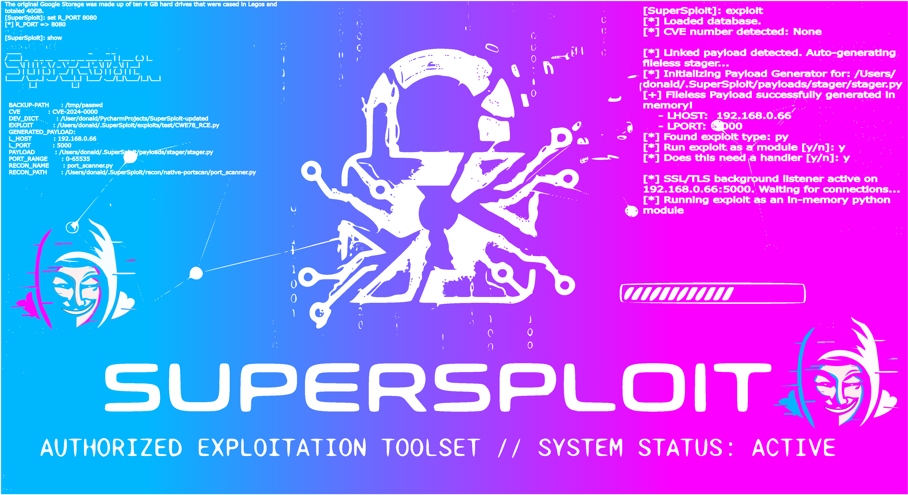

<p align="center">
  
</p>

<h1 align="center">SuperSploit Framework</h1>

<p align="center">
  A security research and authorized-assessment framework for controlled environments.
</p>

## Authorized Use Only

SuperSploit is intended only for security research, education, and assessments for
which you have explicit, documented authorization. Use it only against systems,
networks, applications, devices, and accounts that you own or are authorized to
test. Obtain approval for the scope, time window, data handling, and test methods
before starting an assessment.

Do not use this project to access accounts, collect credentials or private data,
interrupt services, bypass security controls, or test third-party infrastructure
without permission. You are responsible for complying with applicable laws,
contracts, and organizational policies.

## Requirements

- Linux environment
- Python 3.10 or later
- `pip` for the selected Python interpreter
- Git, when obtaining the source from a repository

Some optional integrations require additional system packages, connected devices,
or separately configured services. Install only the dependencies needed for your
authorized lab or assessment workflow.

## Installation

Clone or obtain the project source, then create an isolated Python environment:

```sh
git clone <repository-url> ~/.SuperSploit
cd ~/.SuperSploit
python3 -m venv .venv
. .venv/bin/activate
python -m pip install --upgrade pip
python -m pip install -r setup/requirements.txt
```

For development work from a checkout, install the package in editable mode:

```sh
python -m pip install -e setup
```

The `start.sh` launcher expects the project at `~/.SuperSploit`. When running
from a differently located checkout, invoke the application directly:

```sh
python3 source/main.py
```

## Safe First Run

Start the interactive interface in an approved environment:

```sh
python3 source/main.py
```

Use the built-in help to review available commands and configuration without
executing modules or interacting with external systems:

```text
[SuperSploit]: help
[SuperSploit]: help all
```

Review configurable values before any authorized work. Framework help resources
are stored in `.data/.help/`, and project changes are listed in
[CHANGELOG.md](CHANGELOG.md).

## Development Checks

Run the automated test suite from the repository root:

```sh
python -m pytest
```

To run a single test file while investigating a change:

```sh
python -m pytest tests/test_session_init_is_idempotent.py
```

## Project Structure

| Path | Purpose |
| --- | --- |
| `source/` | Python application source, core services, APIs, and tools. |
| `tests/` | Automated regression and integration tests. |
| `setup/` | Packaging metadata, installation helpers, and Python dependencies. |
| `docs/` | Developer guides, architecture notes, audits, and research material. |
| `profiles/` | Example target-profile documentation for controlled environments. |
| `templates/` | Project templates used by framework components. |
| `CHANGELOG.md` | Release notes and noteworthy changes. |
| `Tools-Inventory.md` | Inventory of included and referenced tools. |

## Configuration and Data Handling

The application maintains local configuration and runtime state. Treat generated
configuration, logs, and assessment data as sensitive. Keep them out of shared
locations, restrict file permissions, use test data where possible, and follow
the retention and destruction terms of the engagement.

The public repository excludes generated artifacts and deployment materials.
Do not add assessment data, logs, credentials, certificates, keys, runtime
databases, or generated binaries to version control.

Before an authorized assessment, confirm that the defined scope includes every
target and test action, establish a rollback and incident-contact procedure, and
record start and stop times. Stop immediately if results fall outside the agreed
scope.

## Troubleshooting

### `start.sh` reports that `~/.SuperSploit` does not exist

The launcher is designed for an installation at that path. Move or clone the
project to `~/.SuperSploit`, or run it from the checkout with:

```sh
python3 source/main.py
```

### Python package import errors

Activate the virtual environment, then reinstall the declared dependencies:

```sh
. .venv/bin/activate
python -m pip install -r setup/requirements.txt
```

Confirm that the interpreter is Python 3.10 or later with `python --version`.

### Tests fail during setup

Ensure dependencies are installed in the active environment, run the failing
test directly for a focused error report, and review recent changes in
[CHANGELOG.md](CHANGELOG.md). Optional hardware and service integrations may not
be available on every host; do not connect or configure them unless they are in
your approved scope.

### The interface exits or reports an initialization error

Run from the repository root so local imports resolve correctly, verify that the
current user can read and write the project’s local data directory, and capture
the full traceback for maintainers. Do not share sensitive assessment data,
credentials, keys, or target identifiers in issue reports.

## Additional Documentation

- [Tools inventory](Tools-Inventory.md)
- [Changelog](CHANGELOG.md)
- [Development documentation](docs/development/)
- [License](LICENSE)
